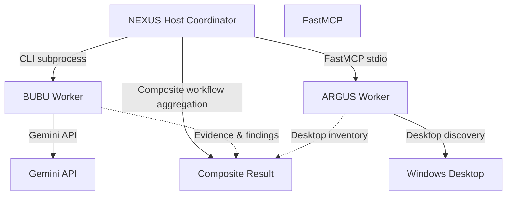

# NEXUS Integration Verification

This document records the empirical verification of the multi-worker composite workflow in NEXUS, coordinating **BUBU** and **ARGUS** in a live test environment. The test confirmed that NEXUS successfully orchestrated both workers within a single sequential workflow, executing each worker through its designated transport and aggregating the findings into a unified composite response.

---

## Verification Status

```text
Status: VERIFIED
Test: TEST 4 — Real End-to-End Composite Multi-Worker Test
Date: 2026-09-22
Result: PASS
Steps: 2/2
Duration: 37.601s
Workflow ID: wf-exp-20260922153600-5f734f
```

---

## Test Architecture

The following diagram illustrates the execution topology evaluated during this integration test:



> **Topology Note:** BUBU and ARGUS do not communicate directly. NEXUS acts as the host coordinator, executing each worker sequentially and aggregating their independent outputs.

---

## What Was Actually Tested

### 1. NEXUS → BUBU Execution Path
- **Adapter:** `BubuAdapter` (`orchestrator/adapters/bubu_adapter.py`)
- **Transport:** External CLI subprocess invoking `ai_worker.py`
- **LLM Call:** Live API request dispatched to Google Gemini Cloud
- **Model Selected:** `gemini-3.5-flash-lite`
- **Output:** Execution status reported as `success` with evidence records ingested into NEXUS `EvidenceStore`

### 2. NEXUS → ARGUS Execution Path
- **Adapter:** `ArgusAdapter` (`orchestrator/adapters/argus_adapter.py`)
- **Transport:** FastMCP over `stdio` communicating with ARGUS `server.py`
- **Tool Invoked:** `smart_ui_desktop_items`
- **Operation:** Windows Shell desktop discovery
- **Discovered Items:** 47 desktop items enumerated
- **Marker Verification:** Test marker `0_COMPOSITE_WORKFLOW_MARKER_c53643.txt` successfully detected (`target_marker_found: true`)
- **Output:** Execution status reported as `success` with zero multimodal token overhead

### 3. Composite Workflow Aggregation
- **Method:** `Orchestrator.execute_workflow()` (`orchestrator/orchestrator.py`)
- **Execution Mode:** Sequential multi-worker composite workflow
- **Steps:** 2 total, 2 executed (Step 1: BUBU, Step 2: ARGUS)
- **Workflow ID:** `wf-exp-20260922153600-5f734f`
- **Aggregated Findings:** 15 items compiled
- **Aggregated Evidence:** 1 verified evidence entry preserved
- **Final Status:** `success` in 37.601 seconds

---

## Evidence Artifacts

The execution was captured and committed to version control in the following artifact files:

1. **`tests/artifacts/last_composite_workflow.json`**: Active latest pointer for composite integration tests.
2. **`tests/artifacts/composite_workflow_2026-09-22_run2.json`**: Dedicated timestamped proof file preserving the full diagnostic telemetry of this test run.

**Associated Git Commit:**
- Commit Hash: [`0e13eb9d061f62a2f0359a4415aafdbde2d63ee5`](https://github.com/aethelondev-stack/NEXUS/commit/0e13eb9d061f62a2f0359a4415aafdbde2d63ee5)
- Commit Message: `test: add real nexus bubu argus composite integration evidence`

---

## Important Scope & Limitations

To ensure accurate engineering boundaries, the scope of this test is clarified as follows:

- **No Peer-to-Peer Worker Channel:** BUBU and ARGUS do not communicate directly. Both workers are invoked, managed, and correlated solely by NEXUS within the composite workflow.
- **Specific ARGUS Capability:** This test verified Windows desktop discovery via `smart_ui_desktop_items`. It did **not** evaluate visual pixel analysis, screenshot perceptual diffing, or OCR recognition.
- **Independent Data Flows:** This test did not evaluate BUBU consuming or reasoning over ARGUS's desktop discoveries; each worker executed its own step within the coordinator workflow.
- **Boundary of Proof:** This verification confirms that this specific, live integration path executes end-to-end without timeout or transport failure. It does not imply that every conceivable production configuration or failure mode has been exercised.

---

## Cleanup Verification

Following the completion of TEST 4, the test harness verified complete environmental cleanup:

- Temporary test fixture (`composite_fixture_c53643.py`) removed from workspace.
- Desktop marker (`0_COMPOSITE_WORKFLOW_MARKER_c53643.txt`) cleanly unlinked.
- `workers.json` restored to its baseline configuration.
- No unexpected residue or temporary files remained in the working tree.
- No source code files in NEXUS, BUBU, or ARGUS were modified during the test execution.

---

## Verification Conclusion

> The tested NEXUS composite workflow successfully executed BUBU through its CLI/Gemini path and ARGUS through its FastMCP path in the same workflow, and aggregated both worker results into a successful composite response.
